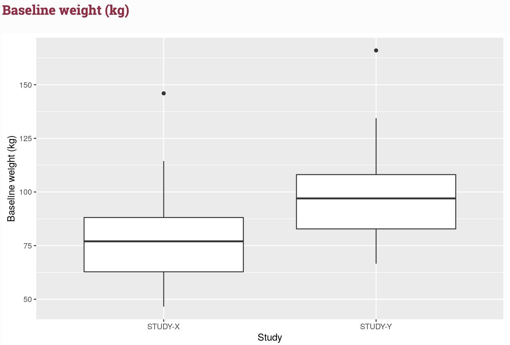

<!-- README.md is generated from README.Rmd. Please edit that file -->

## Overview

mrgda is a NONMEM data assembly helper, providing a set of functions
that help you assemble, explore and validate your data set.

To use mrgda optimally, you are encouraged to set up your data
specification file in `yaml` format, similar to the example found
[here](https://github.com/metrumresearchgroup/mrgda/blob/main/inst/derived/pk.yml)
and discussed further in the `Setup` section below.

## Setup

Before running mrgda, a `flags` parameter needs to be defined within the
`SETUP` section of the data specification yaml file. All relevant column
names need to be defined for each of the following flags:

-   `id` - subject identification (typically ID)
-   `study` - study identification
-   `primary_keys` - event defining variables (ie. EVID and DVID)
-   `time` - time
-   `bl_cat_cov` - baseline categorical covariates
-   `tv_cat_cov` - time-varying categorical covariates
-   `bl_cont_cov` - baseline continuous covariates
-   `tv_cont_cov` - time-varying continuous covariates

Note in the example below that multiple variables can be listed for each
flag and that not all flags need to be defined. For instance, no
time-varying categorical covariates are listed below.

``` r
SETUP:
  flags:
    id: [ID]
    study: [STUDYID]
    primary_keys: [EVID, DVID]
    time: [TIME]
    bl_cat_cov: [SEX, RACE]
    bl_cont_cov: [WTBL, BMIBL, AGEBL] 
    tv_cont_cov: [WT]
```

## Usage

### Data validation

To validate your data, simply provide `nm_validate()` with your NONMEM
data set and data specification. It’s output will indicate the result of
a series of pass/fail validation checks.

``` r
library(mrgda)
nm_validate(.data = nm, .spec = nm_spec, .error_on_fail = FALSE)
```

    ── nm_validate() results: ──────────────────────────────────────────────────────

    ✔ No duplicate primary keys

    ✔ Non-unique baseline covariates

    ✔ No missing covariates

    ✔ Non-finite TIME values

    ✔ MDV not set to 1 when DV is NA

    ✖ All NUM values are unique -- Copy/paste and run the following code:

    nm %>%
     dplyr::select(NUM) %>%
     dplyr::group_by(across(NUM)) %>%
     dplyr::add_count() %>%
     dplyr::ungroup() %>%
     dplyr::filter(n > 1)

    [ FAIL 1 | SKIP 0 | PASS 5 ]

If an error is found in the data, you will be provided with code to help
debug where the problem occurs.

``` r
nm_validate(.data = nm2, .spec = nm_spec, .error_on_fail = FALSE)
```

    ## 

    ## ── nm_validate() results: ──────────────────────────────────────────────────────

    ## ✔ No duplicate primary keys

    ## ✔ Non-unique baseline covariates

    ## ✔ No missing covariates

    ## ✔ Non-finite TIME values

    ## ✔ MDV not set to 1 when DV is NA

    ## ✔ All NUM values are unique

    ## 
    ## [ FAIL 0 | SKIP 0 | PASS 6 ]

### Data summary

To explore your data, provide `nm_summary()` with your NONMEM data set
and data specification. A html document will be generated with tables
and figures to help you visualize your data.

``` r
nm_summary(.data = nm, .spec = nm_spec)
```




## Documentation

Public documentation of all functions is hosted at
<https://metrumresearchgroup.github.io/mrgda/>

## Development

`mrgda` uses [pkgr](https://github.com/metrumresearchgroup/pkgr) to
manage development dependencies and
[renv](https://rstudio.github.io/renv/) to provide isolation. To
replicate this environment,

1.  clone the repo

2.  install pkgr

3.  open package in an R session and run `renv::init(bare = TRUE)`

    -   install `renv` \> 0.8.3-4 into default `.libPaths()` if not
        already installed

4.  run `pkgr install` in terminal within package directory

5.  restart session

Then, launch R with the repo as the working directory (open the project
in RStudio). renv will activate and find the project library.

## Getting help

If you encounter a clear bug, please file an issue with a minimal
reproducible example on [mrgda](https://github.com/mrgda/issues).
