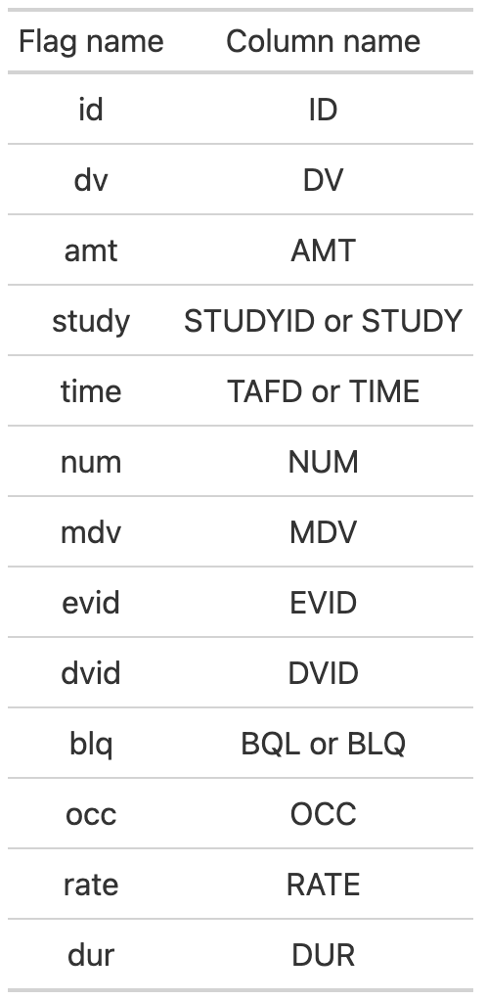

<!-- README.md is generated from README.Rmd. Please edit that file -->

## Overview

mrgda is a NONMEM data assembly helper, providing a set of functions
that help you assemble, explore and validate your data set.

To use mrgda optimally, you are encouraged to set up your data
specification file in `yaml` format, similar to the example found
[here](https://github.com/metrumresearchgroup/mrgda/blob/main/inst/derived/pk.yml)
and discussed further in the `Setup` section below.

## Setup

`nm_validate()` and `nm_summary()` extract knowledge from your data
through the use of column flags that can be setup in your data
specification file. Some flags change project to project, such as ones
defining covariates. These need to be defined in the data specification
file as such:

``` r
SETUP:
  flags:
    bl_cat_cov: [SEX, RACE]
    bl_cont_cov: [WTBL, BMIBL, AGEBL]
    tv_cat_cov: [HEPAT]
    tv_cont_cov: [WT]
```

Every column name that fits each category is listed as shown above. The
definitions for these flags are as such:

-   `bl_cat_cov` - baseline categorical covariates
-   `bl_cont_cov` - baseline continuous covariates
-   `tv_cat_cov` - time-varying categorical covariates
-   `tv_cont_cov` - time-varying continuous covariates

Other columns will also be utilized, so it is recommended to use the
following column names in your data:

<figure>

<figcaption aria-hidden="true">Flag definitions</figcaption>
</figure>

If you have a column name that is different than the expected one shown
above, you can define it in your specification file as shown below. Here
we are defining our `study` column name as `STUDYN`.

``` r
SETUP:
  flags:
    study: [STUDYN]
    bl_cat_cov: [SEX, RACE]
    bl_cont_cov: [WTBL, BMIBL, AGEBL]
    tv_cat_cov: [HEPAT]
    tv_cont_cov: [WT]
```

## Usage

### Data validation

To validate your data, simply provide `nm_validate()` with your NONMEM
data set and data specification. It’s output will indicate the result of
a series of pass/fail validation checks.

``` r
library(mrgda)
nm_validate(.data = nm_final_corrected, .spec = nm_spec, .error_on_fail = FALSE)
```

    ── nm_validate() results: ──────────────────────────────────────────────────────

    ✔ No duplicate records

    ✔ Non-unique baseline covariates

    ✔ No missing covariates

    ✔ Non-finite TIME values

    ✔ MDV not set to 1 when DV is NA

    ✔ All NUM values are unique

    ✔ All dosing AMT values are equivalent to RATE * DUR


    [ FAIL 0 | SKIP 0 | PASS 7 ]

If an error is found in the data, you will be provided with code to help
debug where the problem occurs.

``` r
nm_validate(.data = nm_final, .spec = nm_spec, .error_on_fail = FALSE)
```

    ## 

    ## ── nm_validate() results: ──────────────────────────────────────────────────────

    ## ✔ No duplicate records

    ## ✔ Non-unique baseline covariates

    ## ✔ No missing covariates

    ## ✔ Non-finite TIME values

    ## ✔ MDV not set to 1 when DV is NA

    ## ✔ All dosing AMT values are equivalent to RATE * DUR

    ## ✖ All NUM values are unique -- Copy/paste and run the following code:

    ## nm_final %>%
    ##  dplyr::select(NUM) %>%
    ##  dplyr::group_by(across(NUM)) %>%
    ##  dplyr::add_count() %>%
    ##  dplyr::ungroup() %>%
    ##  dplyr::filter(n > 1)
    ## 
    ## [ FAIL 1 | SKIP 0 | PASS 6 ]

### Data summary

To explore your data, provide `nm_summary()` with your NONMEM data set
and data specification. A html document will be generated with tables
and figures to help you visualize your data.

``` r
nm_summary(.data = nm, .spec = nm_spec)
```


## Documentation

Public documentation of all functions is hosted at
<https://metrumresearchgroup.github.io/mrgda/>

## Development

`mrgda` uses [pkgr](https://github.com/metrumresearchgroup/pkgr) to
manage development dependencies and
[renv](https://rstudio.github.io/renv/) to provide isolation. To
replicate this environment,

1.  clone the repo

2.  install pkgr

3.  open package in an R session and run `renv::init(bare = TRUE)`

    -   install `renv` \> 0.8.3-4 into default `.libPaths()` if not
        already installed

4.  run `pkgr install` in terminal within package directory

5.  restart session

Then, launch R with the repo as the working directory (open the project
in RStudio). renv will activate and find the project library.

## Getting help

If you encounter a clear bug, please file an issue with a minimal
reproducible example on [mrgda](https://github.com/mrgda/issues).
