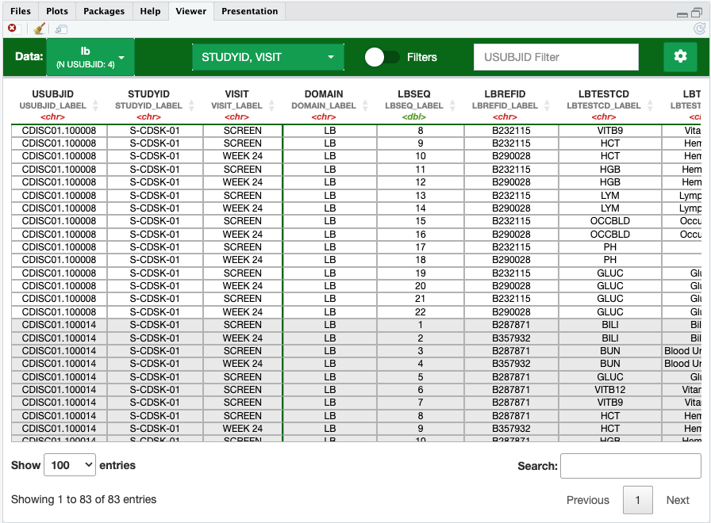

```{r, include = FALSE}
knitr::opts_chunk$set(
  collapse = TRUE,
  comment = "#>"
)
```

# Introduction

This vignette takes the user through some basic scenarios for exploring, 
assembling, and validating data sets using `mrgda`, introducing you to its 
standard workflow and functionality. For more information how to effectively 
integrate `mrgda` into your workflow, visit the 
<a href="https://merge.metrumrg.com/expo/expo1-nonmem-foce/" target="_blank">
MeRGE Expo</a>.

```{r setup_interactive, include=FALSE}
if (interactive() || isTRUE(getOption('knitr.in.progress'))) {
  devtools::load_all()
  Sys.setenv('MRGDA_SHINY_DEV_LOAD_PATH' = here::here())
}
```

```{r load packages, results = 'hide', message=FALSE, warning=FALSE}
library(mrgda)
library(dplyr)
```


# Source data

We begin by pointing to a source directory containing the source data (typically
STDM or ADaM datasets). `read_src_dir` will read in every data file and return a
named list of the data objects, as well as some additional metadata.
```{r, message = FALSE, results = 'hide'}
src_path <- system.file("example-sdtm", package = "mrgda")

# Read in all XPT files in source directory
src_list <- mrgda::read_src_dir(src_path, .file_types = "xpt")
```

## Exploring the source data

While it is common practice to use `View()` for inspecting dataframes or 
matrix-like `R` objects, `mrgda` provides a convenient tool for exploring your 
entire source directory. 

```{r, eval=FALSE}
mrgda::v(src_list)
```

`v()` facilitates manual inspections, such as confirming data integrity for a 
specific subject or over specified date range. Note that `v()` runs a `shiny` app
in the Rstudio viewer pane as background process, allowing you to retain control 
over your `R` console:



**Some features include:**

 - Allows you to seamlessly transition between any of the datasets in your list 
 (you can also pass in a single dataframe)
 - Apply global subject filters, filtering each of the datasets in `src_list` to
 only contain the specified subject ID
 - Apply column filters per dataset
 - Groups the data by the specified *or detected* `.subject_col`, helping to 
 differentiate between subject records.
 - Column Organization
    - "Freeze" or lock columns in place while scrolling horizontally
    - Relocate columns to another position
 - Other formatting options related to readability and presentation of column 
 label attributes

### Query source list

In addition to the convenient viewing and filtering methods provided by `v()`, 
you can also query the entire source directory for a specific character string via
`query_src_list()`:
```{r, message = FALSE}
# Summarize source directory
query_src_list(src_list, .string = "RACE")
```


## Save assembled data

After you finish assembling your dataset, you can export the compiled data using
`write_derived`, ensuring both convenience and reproducibility. This function 
produces a CSV, an `xpt` file, and a dedicated folder housing valuable metadata.
This dual export capability enhances data portability, accommodating various use cases.
The specification file, `nm_spec`, is meant to contain information relating to units,
abbreviations, decoding options, and more (see the 
<a href="https://merge.metrumrg.com/expo/expo1-nonmem-foce/" target="_blank">
MeRGE Expo</a> for more information on this).
```{r, eval = FALSE}
nm_spec <- yspec::ys_load(system.file("derived", "pk.yml", package = "mrgda"))
mrgda::write_derived(
  .data = derived$nm,
  .spec = nm_spec,
  .file = here::here("data", "derived", "pk.csv")
)
```


## Other functions

`mrgda` exports other helpful functions for data creation, management, and validation. See the 
<a href="https://metrumresearchgroup.github.io/mrgda/reference/index.html" 
target="_blank">Reference Log</a> for more details.
